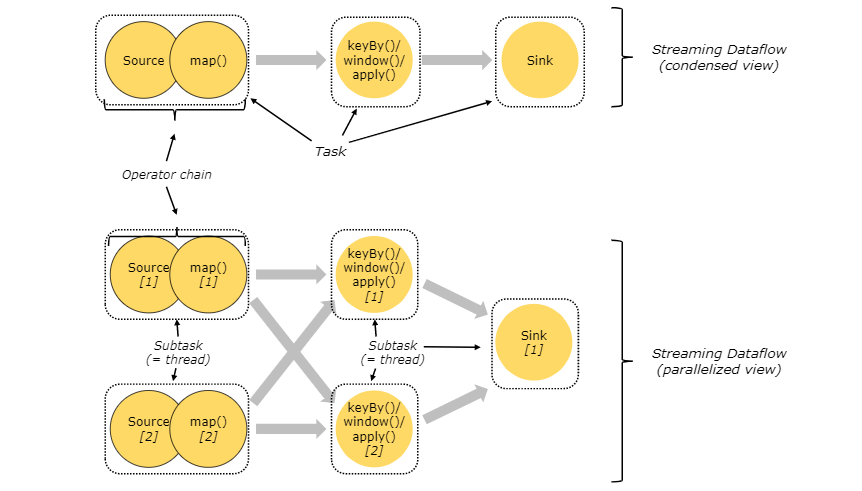

# Flink
> Apache Flink is a framework and distributed processing engine for stateful computations over unbounded and bounded data streams. Flink has been designed to run in all common cluster environments, perform computations at in-memory speed and at any scale
- [Flink](#flink)
  - [概述](#概述)
    - [特点](#特点)
  - [架构](#架构)
    - [集群剖析](#集群剖析)
      - [JobManager](#jobmanager)
      - [TaskManage](#taskmanage)
    - [Tasks and Operator Chains](#tasks-and-operator-chains)
    - [Task Slots and Resources](#task-slots-and-resources)
  - [官网案例演示](#官网案例演示)
  - [DataStream API](#datastream-api)
    - [官网案例](#官网案例)
    - [Flink程序组成](#flink程序组成)
    - [Environmeng](#environmeng)
    - [Data Source](#data-source)
      - [基于文件](#基于文件)
      - [基于Socket](#基于socket)
      - [基于集合](#基于集合)
      - [自定义Source addSource()](#自定义source-addsource)
    - [Transform](#transform)
      - [Overview](#overview)
      - [Process Function](#process-function)
    - [Sink](#sink)
  - [Window](#window)
    - [大体结构](#大体结构)
    - [生命周期](#生命周期)
    - [Window Assigners](#window-assigners)
      - [使用](#使用)
      - [类型](#类型)
    - [Window Functions](#window-functions)
      - [ReduceFunction](#reducefunction)
      - [AggregateFunction](#aggregatefunction)
      - [ProcessWindowFunction](#processwindowfunction)
      - [ProcessWindowFunction with Incremental Aggregation](#processwindowfunction-with-incremental-aggregation)
      - [Using per-window state in ProcessWindowFunction](#using-per-window-state-in-processwindowfunction)
    - [Window Join](#window-join)
      - [基本用法](#基本用法)
    - [Triggers](#triggers)
      - [触发器（Trigger）针对不同事件有不同的方法](#触发器trigger针对不同事件有不同的方法)
      - [`TriggerResult`返回的动作](#triggerresult返回的动作)
      - [内置Trigger](#内置trigger)
    - [Evictors](#evictors)
      - [evictor可以在窗口函数调用前后从window移除元素](#evictor可以在窗口函数调用前后从window移除元素)
      - [内置evictors](#内置evictors)
    - [Allowed Lateness](#allowed-lateness)
    - [Side Output](#side-output)
  - [State](#state)
    - [Keyed State](#keyed-state)
    - [State TTL](#state-ttl)
      - [configuration opteions](#configuration-opteions)
      - [Cleanup of Expired State](#cleanup-of-expired-state)
    - [Operator State](#operator-state)
    - [Using Operator State](#using-operator-state)
      - [CheckpointedFunction](#checkpointedfunction)
      - [redistribution](#redistribution)
    - [Broadcast State](#broadcast-state)
      - [案例说明](#案例说明)
      - [流数据](#流数据)
      - [连接流](#连接流)
      - [KeyedBroadcastProcessFunction匹配逻辑](#keyedbroadcastprocessfunction匹配逻辑)
    - [Checkpointing](#checkpointing)
      - [先决条件](#先决条件)
      - [启用和配置](#启用和配置)
      - [Checkpoint Storage](#checkpoint-storage)
  - [Connectors](#connectors)
    - [DataStream Connectors](#datastream-connectors)
      - [Kafka](#kafka)
        - [Dependency](#dependency)
        - [Kafka Consumer](#kafka-consumer)
        - [Kafka Producer](#kafka-producer)
  - [Time](#time)
    - [语义](#语义)
    - [Watermarks](#watermarks)
      - [Watermarks in Parallel Streams](#watermarks-in-parallel-streams)
      - [介绍Watermark Strategies](#介绍watermark-strategies)
      - [Using Watermark Strategies](#using-watermark-strategies)
      - [处理空闲数据源](#处理空闲数据源)
      - [Writing WatermarkGenerators](#writing-watermarkgenerators)
      - [内置Watermark Generators](#内置watermark-generators)
    - [Lateness](#lateness)
    - [Windowing](#windowing)
  - [Table API & SQL](#table-api--sql)
    - [Structure of Table API and SQL Programs](#structure-of-table-api-and-sql-programs)
    - [TableEnvironment](#tableenvironment)
    - [Table](#table)
      - [创建表](#创建表)
      - [查询表](#查询表)
    - [Emit a Table](#emit-a-table)
    - [集成DataStream和DataSet](#集成datastream和dataset)
    - [Translate and Execute a Query](#translate-and-execute-a-query)
    - [Dynamic Tables](#dynamic-tables)
      - [Dynamic Tables & Continuous Queries](#dynamic-tables--continuous-queries)
      - [Query Restrictions](#query-restrictions)
      - [Table to Stream Conversion](#table-to-stream-conversion)
    - [Table API](#table-api)
      - [Example](#example)
      - [Operations](#operations)
    - [SQL](#sql)
      - [Windowing table-valued functions(1.13)](#windowing-table-valued-functions113)
      - [Window Aggregation](#window-aggregation)
      - [Group Aggregation](#group-aggregation)
      - [Over Aggregation](#over-aggregation)
      - [Joins](#joins)
  - [Flink CEP](#flink-cep)
    - [Getting Started](#getting-started)

## 概述
### 特点
- 事件驱动
- 基于流的世界观
> 有界流和无界流
- 分层API
- 支持事件时间(event-time)和处理时间(processing-time)语义
- exactly-once状态的一致性保证
- 低延迟，每秒处理百万事件，毫秒延迟
- 高可用，动态扩展

## 架构
### 集群剖析
>flink运行时由两类进程组成：一个JobManager和一个或多个TaskManager  


#### JobManager
> 有多项协调Flink应用分布式执行相关的职责：安排任务，对完成或失败的任务作出反应，协调检查点，协调故障恢复
- ResourceManager
> 负责集群资源的分配，管理task slots（flink集群资源调度的单元）；flink针对不同的环境和资源提供实现了多种ResourceManager
-  Dispatcher
> 提供REST接口用来提交flink应用去运行，并为每个已提交的作业启动JobMaster，启动flink WebUI来提供作业运行的信息
-  JobMaster
> 负责管理单个JobGraph运行，多个作业可以同时在flink集群上运行，每个作业都有自己的JobMaster
#### TaskManage
> 运行数据流任务，缓存和交换数据流；TaskManage最小的资源调度单位是task slot，多个operator可以在一个task slot中运行

### Tasks and Operator Chains
> 对于分布式运行，flink把算子子任务串在task中，每个task都在一个线程中执行，可以减少线程到线程切换和缓存的开销，增加整体吞吐量，同时减少延迟。  
> 链接行为可配置  
> 
 

### Task Slots and Resources
- 每一个worker（TaskManager）都是JVM进程，可以在独立的线程中运行一个或多个子任务，拥有至少一个task slot
- 每一个task slot代表TaskManager资源的固定子集，只分隔内存，不隔离CPU
- flink默认允许子任务共享slot，即使是不同task的子任务，只要是来自同一个job

## 官网案例演示

- [欺诈检测系统](https://github.com/kangapp/Flink/tree/master/example/FraudDetection)
- [实时报表系统](https://github.com/kangapp/Flink/tree/master/example/Reporting)
- 批处理wordcount
```scala
package com.test.flink

import org.apache.flink.api.scala.ExecutionEnvironment
import org.apache.flink.api.scala._

object FlinkTestApp {

  def main(args: Array[String]): Unit = {
    //创建一个批处理的执行环境
    val env = ExecutionEnvironment.getExecutionEnvironment

    //从文件中读取数据
    val input:String = "hdfs://hadoop000:9000/data/flink/wc.txt"
    val inputDateSet: DataSet[String] = env.readTextFile(input)

    //对数据进行统计，得到（word,count）
    inputDateSet.flatMap(_.toLowerCase().split("\t")).map((_,1))
      .groupBy(0) //以第一个元素作为key，进行分组
      .sum(1) //对所有数据的第二个元素求和
      .print()
  }
}
```
- 流处理wordcount
```scala
package com.test.flink

import org.apache.flink.streaming.api.scala.{DataStream, StreamExecutionEnvironment}
import org.apache.flink.api.scala._

object StreamingTest {

  def main(args: Array[String]): Unit = {
    //创建流处理的执行环境
    val env = StreamExecutionEnvironment.getExecutionEnvironment
    //设置作业并行度
    env.setParallelism(8)

    //接收一个socket文本流
    val text = env.socketTextStream("localhost",9999)

    //进行转换处理统计
    val resultDataStream: DataStream[(String, Int)] = text
      .flatMap(_.split(" "))
      .map((_, 1))
      .keyBy(item => item._1)
      .sum(1)

    resultDataStream.print()

    //启动任务执行
    env.execute("Streaming test")
  }
}
```
>7> (world,2)  
4> (hello,2)  
3> (bye,1)  
3> (bye,2)  
3> (he,1)  
3> (he,2)  
4> (hello,3)  
3> (bye,3)  

## DataStream API
### [官网案例](https://github.com/kangapp/Flink/tree/master/example/DataStream)

### Flink程序组成
- Obtain an execution environment
- Load/create the initial data
- Specify transformations on this data
- Specify where to put the results of your computations
- Trigger the program execution
### Environmeng
- `getExecutionEnvironment()`
> 创建一个执行环境，表示当前执行程序的上下文，会根据运行方式返回不同的执行环境：
- createLocalEnvironment()
- createRemoteEnvironment(host: String, port: Int, jarFiles: String*)

### Data Source
#### 基于文件
- `readTextFile(path)`
#### 基于Socket
- `socketTextStream`
#### 基于集合
- `fromCollection() `
#### 自定义Source addSource()
- `SourceFunction` 
- `ParallelSourceFunction`
- `RichParallelSourceFunction`
- connectors
### Transform
#### Overview
- 简单转换算子(DataStream → DataStream)
- 分组(DataStream → KeyedStream)
- 分组聚合(KeyedStream → DataStream)
- 窗口函数(KeyedStream → WindowedStream,DataStream → AllWindowedStream)
- 分流操作(ConnectedStreams → DataStream)
- 合流操作(DataStream,DataStream → ConnectedStreams)
- [更多](https://ci.apache.org/projects/flink/flink-docs-release-1.12/dev/stream/operators/#datastream-transformations)
#### Process Function
> 低级别流处理操作，可以访问基础的构造块
- events (stream elements)
- state (fault-tolerant, consistent, only on keyed stream)
- timers (event time and processing time, only on keyed stream)
> example
```scala
import org.apache.flink.api.common.state.ValueState
import org.apache.flink.api.common.state.ValueStateDescriptor
import org.apache.flink.api.java.tuple.Tuple
import org.apache.flink.streaming.api.functions.KeyedProcessFunction
import org.apache.flink.util.Collector

// the source data stream
val stream: DataStream[Tuple2[String, String]] = ...

// apply the process function onto a keyed stream
val result: DataStream[Tuple2[String, Long]] = stream
  .keyBy(_._1)
  .process(new CountWithTimeoutFunction())

/**
  * The data type stored in the state
  */
case class CountWithTimestamp(key: String, count: Long, lastModified: Long)

/**
  * The implementation of the ProcessFunction that maintains the count and timeouts
  */
class CountWithTimeoutFunction extends KeyedProcessFunction[Tuple, (String, String), (String, Long)] {

  /** The state that is maintained by this process function */
  lazy val state: ValueState[CountWithTimestamp] = getRuntimeContext
    .getState(new ValueStateDescriptor[CountWithTimestamp]("myState", classOf[CountWithTimestamp]))


  override def processElement(
      value: (String, String), 
      ctx: KeyedProcessFunction[Tuple, (String, String), (String, Long)]#Context, 
      out: Collector[(String, Long)]): Unit = {

    // initialize or retrieve/update the state
    val current: CountWithTimestamp = state.value match {
      case null =>
        CountWithTimestamp(value._1, 1, ctx.timestamp)
      case CountWithTimestamp(key, count, lastModified) =>
        CountWithTimestamp(key, count + 1, ctx.timestamp)
    }

    // write the state back
    state.update(current)

    // schedule the next timer 60 seconds from the current event time
    ctx.timerService.registerEventTimeTimer(current.lastModified + 60000)
  }

  override def onTimer(
      timestamp: Long, 
      ctx: KeyedProcessFunction[Tuple, (String, String), (String, Long)]#OnTimerContext, 
      out: Collector[(String, Long)]): Unit = {

    state.value match {
      case CountWithTimestamp(key, count, lastModified) if (timestamp == lastModified + 60000) =>
        out.collect((key, count))
      case _ =>
    }
  }
}
```
### Sink
- `writeAsText()`
- `print()`
- `addSink()`
## Window

### 大体结构
- Keyed Windows
>  Having a keyed stream will allow your windowed computation to be performed in parallel by multiple tasks
```scala
stream
       .keyBy(...)               <-  keyed versus non-keyed windows
       .window(...)              <-  required: "assigner"
      [.trigger(...)]            <-  optional: "trigger" (else default trigger)
      [.evictor(...)]            <-  optional: "evictor" (else no evictor)
      [.allowedLateness(...)]    <-  optional: "lateness" (else zero)
      [.sideOutputLateData(...)] <-  optional: "output tag" (else no side output for late data)
       .reduce/aggregate/fold/apply()      <-  required: "function"
      [.getSideOutput(...)]      <-  optional: "output tag"
```
- Non-Keyed Windows
> your original stream will not be split into multiple logical streams and all the windowing logic will be performed by a single task
```scala
stream
       .windowAll(...)           <-  required: "assigner"
      [.trigger(...)]            <-  optional: "trigger" (else default trigger)
      [.evictor(...)]            <-  optional: "evictor" (else no evictor)
      [.allowedLateness(...)]    <-  optional: "lateness" (else zero)
      [.sideOutputLateData(...)] <-  optional: "output tag" (else no side output for late data)
       .reduce/aggregate/fold/apply()      <-  required: "function"
      [.getSideOutput(...)]      <-  optional: "output tag"
```
### 生命周期
- created 
>window is created as soon as the first element that should belong to this window arrives
- removed 
>window is completely removed when the time (event or processing time) passes its end timestamp plus the user-specified allowed lateness
- Trigger
>each window will have a Trigger and a function (ProcessWindowFunction, ReduceFunction, or AggregateFunction) attached to it
- Evictor
>emove elements from the window after the trigger fires and before and/or after the function is applied.

### Window Assigners
> The window assigner defines how elements are assigned to windows
#### 使用
- window(...) (for keyed streams)
- windowAll() (for non-keyed streams)
#### 类型
- tumbling windows
```scala
val input: DataStream[T] = ...

// tumbling event-time windows
input
    .keyBy(<key selector>)
    .window(TumblingEventTimeWindows.of(Time.seconds(5)))
    .<windowed transformation>(<window function>)

// tumbling processing-time windows
input
    .keyBy(<key selector>)
    .window(TumblingProcessingTimeWindows.of(Time.seconds(5)))
    .<windowed transformation>(<window function>)

// daily tumbling event-time windows offset by -8 hours.
input
    .keyBy(<key selector>)
    .window(TumblingEventTimeWindows.of(Time.days(1), Time.hours(-8)))
    .<windowed transformation>(<window function>)
```
- sliding windows
```scala
val input: DataStream[T] = ...

// sliding event-time windows
input
    .keyBy(<key selector>)
    .window(SlidingEventTimeWindows.of(Time.seconds(10), Time.seconds(5)))
    .<windowed transformation>(<window function>)

// sliding processing-time windows
input
    .keyBy(<key selector>)
    .window(SlidingProcessingTimeWindows.of(Time.seconds(10), Time.seconds(5)))
    .<windowed transformation>(<window function>)

// sliding processing-time windows offset by -8 hours
input
    .keyBy(<key selector>)
    .window(SlidingProcessingTimeWindows.of(Time.hours(12), Time.hours(1), Time.hours(-8)))
    .<windowed transformation>(<window function>)
```
- session windows
```scala
val input: DataStream[T] = ...

// event-time session windows with static gap
input
    .keyBy(<key selector>)
    .window(EventTimeSessionWindows.withGap(Time.minutes(10)))
    .<windowed transformation>(<window function>)

// event-time session windows with dynamic gap
input
    .keyBy(<key selector>)
    .window(EventTimeSessionWindows.withDynamicGap(new SessionWindowTimeGapExtractor[String] {
      override def extract(element: String): Long = {
        // determine and return session gap
      }
    }))
    .<windowed transformation>(<window function>)

// processing-time session windows with static gap
input
    .keyBy(<key selector>)
    .window(ProcessingTimeSessionWindows.withGap(Time.minutes(10)))
    .<windowed transformation>(<window function>)


// processing-time session windows with dynamic gap
input
    .keyBy(<key selector>)
    .window(DynamicProcessingTimeSessionWindows.withDynamicGap(new SessionWindowTimeGapExtractor[String] {
      override def extract(element: String): Long = {
        // determine and return session gap
      }
    }))
    .<windowed transformation>(<window function>)
```
- global windows
```scala
val input: DataStream[T] = ...

input
    .keyBy(<key selector>)
    .window(GlobalWindows.create())
    .<windowed transformation>(<window function>)
```
### Window Functions
#### ReduceFunction
> A ReduceFunction specifies how two elements from the input are combined to produce an output element of the same type
```scala
val input: DataStream[(String, Long)] = ...

input
    .keyBy(<key selector>)
    .window(<window assigner>)
    .reduce { (v1, v2) => (v1._1, v1._2 + v2._2) }
```
#### AggregateFunction
```scala
/**
 * The accumulator is used to keep a running sum and a count. The [getResult] method
 * computes the average.
 */
class AverageAggregate extends AggregateFunction[(String, Long), (Long, Long), Double] {
  override def createAccumulator() = (0L, 0L)

  override def add(value: (String, Long), accumulator: (Long, Long)) =
    (accumulator._1 + value._2, accumulator._2 + 1L)

  override def getResult(accumulator: (Long, Long)) = accumulator._1 / accumulator._2

  override def merge(a: (Long, Long), b: (Long, Long)) =
    (a._1 + b._1, a._2 + b._2)
}

val input: DataStream[(String, Long)] = ...

input
    .keyBy(<key selector>)
    .window(<window assigner>)
    .aggregate(new AverageAggregate)
```
#### ProcessWindowFunction
>A ProcessWindowFunction gets an Iterable containing all the elements of the window, and a Context object with access to time and state information
- 概览
```scala
public abstract class ProcessWindowFunction<IN, OUT, KEY, W extends Window> implements Function {

    /**
     * Evaluates the window and outputs none or several elements.
     *
     * @param key The key for which this window is evaluated.
     * @param context The context in which the window is being evaluated.
     * @param elements The elements in the window being evaluated.
     * @param out A collector for emitting elements.
     *
     * @throws Exception The function may throw exceptions to fail the program and trigger recovery.
     */
    public abstract void process(
            KEY key,
            Context context,
            Iterable<IN> elements,
            Collector<OUT> out) throws Exception;

   	/**
   	 * The context holding window metadata.
   	 */
   	public abstract class Context implements java.io.Serializable {
   	    /**
   	     * Returns the window that is being evaluated.
   	     */
   	    public abstract W window();

   	    /** Returns the current processing time. */
   	    public abstract long currentProcessingTime();

   	    /** Returns the current event-time watermark. */
   	    public abstract long currentWatermark();

   	    /**
   	     * State accessor for per-key and per-window state.
   	     *
   	     * <p><b>NOTE:</b>If you use per-window state you have to ensure that you clean it up
   	     * by implementing {@link ProcessWindowFunction#clear(Context)}.
   	     */
   	    public abstract KeyedStateStore windowState();

   	    /**
   	     * State accessor for per-key global state.
   	     */
   	    public abstract KeyedStateStore globalState();
   	}

}
```
- 使用案例
```scala
val input: DataStream[(String, Long)] = ...

input
  .keyBy(_._1)
  .window(TumblingEventTimeWindows.of(Time.minutes(5)))
  .process(new MyProcessWindowFunction())

/* ... */

class MyProcessWindowFunction extends ProcessWindowFunction[(String, Long), String, String, TimeWindow] {

  def process(key: String, context: Context, input: Iterable[(String, Long)], out: Collector[String]) = {
    var count = 0L
    for (in <- input) {
      count = count + 1
    }
    out.collect(s"Window ${context.window} count: $count")
  }
}
```
#### ProcessWindowFunction with Incremental Aggregation
- Incremental Window Aggregation with ReduceFunction
```scala
val input: DataStream[SensorReading] = ...

input
  .keyBy(<key selector>)
  .window(<window assigner>)
  .reduce(
    (r1: SensorReading, r2: SensorReading) => { if (r1.value > r2.value) r2 else r1 },
    ( key: String,
      context: ProcessWindowFunction[_, _, _, TimeWindow]#Context,
      minReadings: Iterable[SensorReading],
      out: Collector[(Long, SensorReading)] ) =>
      {
        val min = minReadings.iterator.next()
        out.collect((context.window.getStart, min))
      }
  )
```
- Incremental Window Aggregation with AggregateFunction
```scala
val input: DataStream[(String, Long)] = ...

input
  .keyBy(<key selector>)
  .window(<window assigner>)
  .aggregate(new AverageAggregate(), new MyProcessWindowFunction())

// Function definitions

/**
 * The accumulator is used to keep a running sum and a count. The [getResult] method
 * computes the average.
 */
class AverageAggregate extends AggregateFunction[(String, Long), (Long, Long), Double] {
  override def createAccumulator() = (0L, 0L)

  override def add(value: (String, Long), accumulator: (Long, Long)) =
    (accumulator._1 + value._2, accumulator._2 + 1L)

  override def getResult(accumulator: (Long, Long)) = accumulator._1 / accumulator._2

  override def merge(a: (Long, Long), b: (Long, Long)) =
    (a._1 + b._1, a._2 + b._2)
}

class MyProcessWindowFunction extends ProcessWindowFunction[Double, (String, Double), String, TimeWindow] {

  def process(key: String, context: Context, averages: Iterable[Double], out: Collector[(String, Double)]) = {
    val average = averages.iterator.next()
    out.collect((key, average))
  }
}
```
#### Using per-window state in ProcessWindowFunction
> ProcessWindowFunction不仅可以使用keyed state（富函数都可以使用），还可以使用window范围的keyed state，窗口State指向不同的window
- The window that was defined when specifying the windowed operation: This might be tumbling windows of 1 hour or sliding windows of 2 hours that slide by 1 hour.
- An actual instance of a defined window for a given key: This might be time window from 12:00 to 13:00 for user-id xyz. This is based on the window definition and there will be many windows based on the number of keys that the job is currently processing and based on what time slots the events fall into.
> There are two methods on the Context object that a process() invocation receives that allow access to the two types of state:
- globalState(), which allows access to keyed state that is not scoped to a window
- windowState(), which allows access to keyed state that is also scoped to the window

### Window Join

#### 基本用法
```scala
stream.join(otherStream)
    .where(<KeySelector>)
    .equalTo(<KeySelector>)
    .window(<WindowAssigner>)
    .apply(<JoinFunction>)
```

### Triggers
#### 触发器（Trigger）针对不同事件有不同的方法
- The onElement() method is called for each element that is added to a window.
- The onEventTime() method is called when a registered event-time timer fires.
- The onProcessingTime() method is called when a registered processing-time timer fires.
- The onMerge() method is relevant for stateful triggers and merges the states of two triggers when their corresponding windows merge, e.g. when using session windows.
- clear() method performs any action needed upon removal of the corresponding window.
#### `TriggerResult`返回的动作
- CONTINUE: do nothing
- FIRE: trigger the computation
- PURGE: clear the elements in the window
- FIRE_AND_PURGE: trigger the computation and clear the elements in the window afterwards
#### 内置Trigger
- EventTimeTrigger 
- ProcessingTimeTrigger 
- CountTrigger 
- PurgingTrigger 

### Evictors
#### evictor可以在窗口函数调用前后从window移除元素
- evictBefore()
- evictAfter
#### 内置evictors
- CountEvictor
- DeltaEvictor
- TimeEvictor

### Allowed Lateness
> 指定允许元素迟到的时间长度，迟到但未丢失的数据可能会使window重新触发，例如EventTimeTrigger
### Side Output
> 用于配置迟到元素的输出
```scala
val lateOutputTag = OutputTag[T]("late-data")

val input: DataStream[T] = ...

val result = input
    .keyBy(<key selector>)
    .window(<window assigner>)
    .allowedLateness(<time>)
    .sideOutputLateData(lateOutputTag)
    .<windowed transformation>(<window function>)

val lateStream = result.getSideOutput(lateOutputTag)
```

## State

### Keyed State
>只能用于KeyedStream，所有状态仅限于当前输入元素的key
- ValueState<T>  
- ListState<T>
- ReducingState<T>
- AggregatingState<IN, OUT>
- MapState<UK, UV>
>state通过RuntimeContext来访问，因此只有在富函数才有可能  
- ValueState<T> getState(ValueStateDescriptor<T>)
- ReducingState<T> getReducingState(ReducingStateDescriptor<T>)
- ListState<T> getListState(ListStateDescriptor<T>)
- AggregatingState<IN, OUT> getAggregatingState(AggregatingStateDescriptor<IN, ACC, OUT>)
- MapState<UK, UV> getMapState(MapStateDescriptor<UK, UV>)
### State TTL
>A time-to-live (TTL) can be assigned to the keyed state of any type. If a TTL is configured and a state value has expired, the stored value will be cleaned up on a best effort basis
```scala
import org.apache.flink.api.common.state.StateTtlConfig
import org.apache.flink.api.common.state.ValueStateDescriptor
import org.apache.flink.api.common.time.Time

val ttlConfig = StateTtlConfig
    .newBuilder(Time.seconds(1))
    .setUpdateType(StateTtlConfig.UpdateType.OnCreateAndWrite)
    .setStateVisibility(StateTtlConfig.StateVisibility.NeverReturnExpired)
    .build
    
val stateDescriptor = new ValueStateDescriptor[String]("text state", classOf[String])
stateDescriptor.enableTimeToLive(ttlConfig)
```
#### configuration opteions
- newBuilder方法的第一个参数是必需的，代表生存的时间值
- setUpdateType配置何时刷新state TTL
  - StateTtlConfig.UpdateType.OnCreateAndWrite（default）
  - StateTtlConfig.UpdateType.OnReadAndWrite
- setStateVisibility配置读取时是否返回未清除的过期值
  - StateTtlConfig.StateVisibility.NeverReturnExpired（default）
  - StateTtlConfig.StateVisibility.ReturnExpiredIfNotCleanedUp
#### [Cleanup of Expired State](https://ci.apache.org/projects/flink/flink-docs-release-1.12/dev/stream/state/state.html#cleanup-of-expired-state)

### Operator State
>Operator State (or non-keyed state)是和一个并行operator实例绑定的，并且支持在实例之前重新分配状态，通常使用在source/sink的实现和没有分区键的场景


### Using Operator State
>To use operator state, a stateful function can implement the CheckpointedFunction interface.
#### CheckpointedFunction
```scala
void snapshotState(FunctionSnapshotContext context) throws Exception;

void initializeState(FunctionInitializationContext context) throws Exception;
```
- snapshotState()  
  每当checkpoint执行时调用
- initializeState()  
  函数第一次初始化或者从较早的checkpoint恢复时调用
#### redistribution 
- Even-split redistribution  
  getListState(descriptor)
- Union redistribution  
  getUnionListState(descriptor)

>SinkFunction 
```scala
class BufferingSink(threshold: Int = 0)
  extends SinkFunction[(String, Int)]
    with CheckpointedFunction {

  @transient
  private var checkpointedState: ListState[(String, Int)] = _

  private val bufferedElements = ListBuffer[(String, Int)]()

  override def invoke(value: (String, Int), context: Context): Unit = {
    bufferedElements += value
    if (bufferedElements.size == threshold) {
      for (element <- bufferedElements) {
        // send it to the sink
      }
      bufferedElements.clear()
    }
  }

  override def snapshotState(context: FunctionSnapshotContext): Unit = {
    checkpointedState.clear()
    for (element <- bufferedElements) {
      checkpointedState.add(element)
    }
  }

  override def initializeState(context: FunctionInitializationContext): Unit = {
    val descriptor = new ListStateDescriptor[(String, Int)](
      "buffered-elements",
      TypeInformation.of(new TypeHint[(String, Int)]() {})
    )

    checkpointedState = context.getOperatorStateStore.getListState(descriptor)

    if(context.isRestored) {
      for(element <- checkpointedState.get()) {
        bufferedElements += element
      }
    }
  }

}
```
>Source Functions
```scala
class CounterSource
       extends RichParallelSourceFunction[Long]
       with CheckpointedFunction {

  @volatile
  private var isRunning = true

  private var offset = 0L
  private var state: ListState[Long] = _

  override def run(ctx: SourceFunction.SourceContext[Long]): Unit = {
    val lock = ctx.getCheckpointLock

    while (isRunning) {
      // output and state update are atomic
      lock.synchronized({
        ctx.collect(offset)

        offset += 1
      })
    }
  }

  override def cancel(): Unit = isRunning = false
  
  override def initializeState(context: FunctionInitializationContext): Unit = {
    state = context.getOperatorStateStore.getListState(
      new ListStateDescriptor[Long]("state", classOf[Long]))

    for (l <- state.get().asScala) {
      offset = l
    }
  }

  override def snapshotState(context: FunctionSnapshotContext): Unit = {
    state.clear()
    state.add(offset)
  }
}
```
### Broadcast State
#### 案例说明
>流数据包含不同的颜色和形状的对象，找到符合特定规则的相同颜色的对象对，例：一个矩形后跟着三角形
#### 流数据
- Item Steram
>取相同颜色的对象，需按颜色分区
```scala
// key the items by color
KeyedStream<Item, Color> colorPartitionedStream = itemStream
                        .keyBy(new KeySelector<Item, Color>(){...});
```
- Rules Stream
>广播规则数据到所有的下游任务
```scala
// a map descriptor to store the name of the rule (string) and the rule itself.
MapStateDescriptor<String, Rule> ruleStateDescriptor = new MapStateDescriptor<>(
			"RulesBroadcastState",
			BasicTypeInfo.STRING_TYPE_INFO,
			TypeInformation.of(new TypeHint<Rule>() {}));
		
// broadcast the rules and create the broadcast state
BroadcastStream<Rule> ruleBroadcastStream = ruleStream
                        .broadcast(ruleStateDescriptor);
```
#### 连接流
>non-broadcasted stream调用connect()方法，BroadcastStream 作为参数，会生成BroadcastConnectedStream，然后可以用CoProcessFunction调用process()方法，方法包含我们的匹配逻辑，non-broadcasted stream的类型决定调用方法的类型
- keyed  
>KeyedBroadcastProcessFunction.
```scala
public abstract class KeyedBroadcastProcessFunction<KS, IN1, IN2, OUT> {

    public abstract void processElement(IN1 value, ReadOnlyContext ctx, Collector<OUT> out) throws Exception;

    public abstract void processBroadcastElement(IN2 value, Context ctx, Collector<OUT> out) throws Exception;

    public void onTimer(long timestamp, OnTimerContext ctx, Collector<OUT> out) throws Exception;
}
```
- non-keyed  
>BroadcastProcessFunction.
```scala
public abstract class BroadcastProcessFunction<IN1, IN2, OUT> extends BaseBroadcastProcessFunction {

    public abstract void processElement(IN1 value, ReadOnlyContext ctx, Collector<OUT> out) throws Exception;

    public abstract void processBroadcastElement(IN2 value, Context ctx, Collector<OUT> out) throws Exception;
}
```
> 连接流
```scala
DataStream<String> output = colorPartitionedStream
                 .connect(ruleBroadcastStream)
                 .process(
                     
                     // type arguments in our KeyedBroadcastProcessFunction represent: 
                     //   1. the key of the keyed stream
                     //   2. the type of elements in the non-broadcast side
                     //   3. the type of elements in the broadcast side
                     //   4. the type of the result, here a string
                     
                     new KeyedBroadcastProcessFunction<Color, Item, Rule, String>() {
                         // my matching logic
                     }
                 );
```
#### KeyedBroadcastProcessFunction匹配逻辑
```scala
new KeyedBroadcastProcessFunction<Color, Item, Rule, String>() {

    // store partial matches, i.e. first elements of the pair waiting for their second element
    // we keep a list as we may have many first elements waiting
    private final MapStateDescriptor<String, List<Item>> mapStateDesc =
        new MapStateDescriptor<>(
            "items",
            BasicTypeInfo.STRING_TYPE_INFO,
            new ListTypeInfo<>(Item.class));

    // identical to our ruleStateDescriptor above
    private final MapStateDescriptor<String, Rule> ruleStateDescriptor = 
        new MapStateDescriptor<>(
            "RulesBroadcastState",
            BasicTypeInfo.STRING_TYPE_INFO,
            TypeInformation.of(new TypeHint<Rule>() {}));

    @Override
    public void processBroadcastElement(Rule value,
                                        Context ctx,
                                        Collector<String> out) throws Exception {
        ctx.getBroadcastState(ruleStateDescriptor).put(value.name, value);
    }

    @Override
    public void processElement(Item value,
                               ReadOnlyContext ctx,
                               Collector<String> out) throws Exception {

        final MapState<String, List<Item>> state = getRuntimeContext().getMapState(mapStateDesc);
        final Shape shape = value.getShape();
    
        for (Map.Entry<String, Rule> entry :
                ctx.getBroadcastState(ruleStateDescriptor).immutableEntries()) {
            final String ruleName = entry.getKey();
            final Rule rule = entry.getValue();
    
            List<Item> stored = state.get(ruleName);
            if (stored == null) {
                stored = new ArrayList<>();
            }
    
            if (shape == rule.second && !stored.isEmpty()) {
                for (Item i : stored) {
                    out.collect("MATCH: " + i + " - " + value);
                }
                stored.clear();
            }
    
            // there is no else{} to cover if rule.first == rule.second
            if (shape.equals(rule.first)) {
                stored.add(value);
            }
    
            if (stored.isEmpty()) {
                state.remove(ruleName);
            } else {
                state.put(ruleName, stored);
            }
        }
    }
}
```
### Checkpointing

#### 先决条件
- 持久化数据源，在一定时间内可以重播记录。持久化消息队列（kafka...）或文件系统（HDFS...）
- State持久化存储，通常是分布式文件系统（HDFS...）
#### 启用和配置
```scala
val env = StreamExecutionEnvironment.getExecutionEnvironment()

// start a checkpoint every 1000 ms
env.enableCheckpointing(1000)

// advanced options:

// set mode to exactly-once (this is the default)
env.getCheckpointConfig.setCheckpointingMode(CheckpointingMode.EXACTLY_ONCE)

// make sure 500 ms of progress happen between checkpoints
env.getCheckpointConfig.setMinPauseBetweenCheckpoints(500)

// checkpoints have to complete within one minute, or are discarded
env.getCheckpointConfig.setCheckpointTimeout(60000)

// prevent the tasks from failing if an error happens in their checkpointing, the checkpoint will just be declined.
env.getCheckpointConfig.setFailTasksOnCheckpointingErrors(false)

// allow only one checkpoint to be in progress at the same time
env.getCheckpointConfig.setMaxConcurrentCheckpoints(1)

// enables the experimental unaligned checkpoints
env.getCheckpointConfig.enableUnalignedCheckpoints()
```

#### Checkpoint Storage
- JobManagerCheckpointStorage
- The FileSystemCheckpointStorage

## Connectors
### DataStream Connectors
#### Kafka

##### Dependency
```xml
<dependency>
	<groupId>org.apache.flink</groupId>
	<artifactId>flink-connector-kafka_2.11</artifactId>
	<version>1.12.0</version>
</dependency>
```
##### Kafka Consumer
```scala
val properties = new Properties()
properties.setProperty("bootstrap.servers", "localhost:9092")
properties.setProperty("group.id", "test")
val stream = env
    .addSource(new FlinkKafkaConsumer[String]("topic", new SimpleStringSchema(), properties))
```
> kafka开始消费位置配置
```scala
val env = StreamExecutionEnvironment.getExecutionEnvironment()

val myConsumer = new FlinkKafkaConsumer[String](...)
myConsumer.setStartFromEarliest()      // start from the earliest record possible
myConsumer.setStartFromLatest()        // start from the latest record
myConsumer.setStartFromTimestamp(...)  // start from specified epoch timestamp (milliseconds)
myConsumer.setStartFromGroupOffsets()  // the default behaviour

val stream = env.addSource(myConsumer)
```
> 指定每个分区开始消费的偏移量，如果读取的分区没有指定偏移量，将退回到该分区的默认消费组偏移行为.当job失败自动重启或手动从savepoint还原时，不会影响分区的起始位置。
```scala
val specificStartOffsets = new java.util.HashMap[KafkaTopicPartition, java.lang.Long]()
specificStartOffsets.put(new KafkaTopicPartition("myTopic", 0), 23L)
specificStartOffsets.put(new KafkaTopicPartition("myTopic", 1), 31L)
specificStartOffsets.put(new KafkaTopicPartition("myTopic", 2), 43L)

myConsumer.setStartFromSpecificOffsets(specificStartOffsets)
```
> kafka消费者偏移量提交行为配置
- 未启用checkpointing：使用kafka客户端定期提交偏移量的功能
- 启用checkpointing：当checkpoint完成时，kafka comsumer将提交保存在检查点状态的偏移量
> kafka流中包含当前事件时间watermark的特殊记录，kafka消费者允许指定watermark strategy.  
> 可以使用自定义策略或者预定义的策略
```scala
val properties = new Properties()
properties.setProperty("bootstrap.servers", "localhost:9092")
properties.setProperty("group.id", "test")

val myConsumer =
    new FlinkKafkaConsumer("topic", new SimpleStringSchema(), properties);
myConsumer.assignTimestampsAndWatermarks(
    WatermarkStrategy.
        .forBoundedOutOfOrderness(Duration.ofSeconds(20)))

val stream = env.addSource(myConsumer)
```
##### Kafka Producer
```scala
val stream: DataStream[String] = ...

val properties = new Properties
properties.setProperty("bootstrap.servers", "localhost:9092")

val myProducer = new FlinkKafkaProducer[String](
        "my-topic",                  // target topic
        new SimpleStringSchema(),    // serialization schema
        properties,                  // producer config
        FlinkKafkaProducer.Semantic.EXACTLY_ONCE) // fault-tolerance

stream.addSink(myProducer)
```
## Time
### 语义
- Event Time
> In event time, the progress of time depends on the data, not on any wall clocks.Event time programs must specify how to generate Event Time Watermarks, which is the mechanism that signals progress in event time
- Processing Time
> use the system clock of the machines
### Watermarks
> The mechanism in Flink to measure progress in event time is watermarks. Watermarks flow as part of the data stream and carry a timestamp
#### Watermarks in Parallel Streams  
- Watermarks are generated at, or directly after, source functions. Each parallel subtask of a source function usually generates its watermarks `independently`  
- Some operators consume multiple input streams; a union, for example, or operators following a keyBy(…) or partition(…) function. Such an operator’s current event time is the `minimum` of its input streams’ event times
#### 介绍Watermark Strategies
> TimestampAssigner:从数据抽取某些字段的时间戳  
> WatermarkGenerator：告诉系统时间发生的时间
```scala
public interface WatermarkStrategy<T> extends TimestampAssignerSupplier<T>, WatermarkGeneratorSupplier<T>{

    /**
     * Instantiates a {@link TimestampAssigner} for assigning timestamps according to this
     * strategy.
     */
    @Override
    TimestampAssigner<T> createTimestampAssigner(TimestampAssignerSupplier.Context context);

    /**
     * Instantiates a WatermarkGenerator that generates watermarks according to this strategy.
     */
    @Override
    WatermarkGenerator<T> createWatermarkGenerator(WatermarkGeneratorSupplier.Context context);
}
```
> 可以通过WatermarkStrategy提供的静态方法来创建
```scala
WatermarkStrategy
  .forBoundedOutOfOrderness[(Long, String)](Duration.ofSeconds(20))
  .withTimestampAssigner(new SerializableTimestampAssigner[(Long, String)] {
    override def extractTimestamp(element: (Long, String), recordTimestamp: Long): Long = element._1
  })
```
#### Using Watermark Strategies
> WatermarkStrategy在flink程序中可以在两处地方使用：
- directly on sources
- after non-source operation
```scala
val env = StreamExecutionEnvironment.getExecutionEnvironment

val stream: DataStream[MyEvent] = env.readFile(
         myFormat, myFilePath, FileProcessingMode.PROCESS_CONTINUOUSLY, 100,
         FilePathFilter.createDefaultFilter())

val withTimestampsAndWatermarks: DataStream[MyEvent] = stream
        .filter( _.severity == WARNING )
        .assignTimestampsAndWatermarks(<watermark strategy>)

withTimestampsAndWatermarks
        .keyBy( _.getGroup )
        .window(TumblingEventTimeWindows.of(Time.seconds(10)))
        .reduce( (a, b) => a.add(b) )
        .addSink(...)
```
#### 处理空闲数据源
> 当某些分区空闲时，watermark不会更新因为是取所有并行的最小值
```scala
WatermarkStrategy
  .forBoundedOutOfOrderness[(Long, String)](Duration.ofSeconds(20))
  .withIdleness(Duration.ofMinutes(1))
```
#### Writing WatermarkGenerators
```scala
public interface WatermarkGenerator<T> {

    /**
     * Called for every event, allows the watermark generator to examine and remember the
     * event timestamps, or to emit a watermark based on the event itself.
     */
    void onEvent(T event, long eventTimestamp, WatermarkOutput output);

    /**
     * Called periodically, and might emit a new watermark, or not.
     *
     * <p>The interval in which this method is called and Watermarks are generated
     * depends on {@link ExecutionConfig#getAutoWatermarkInterval()}.
     */
    void onPeriodicEmit(WatermarkOutput output);
}
```
- Writing a Periodic WatermarkGenerator
> watermark产生间隔通过`ExecutionConfig.setAutoWatermarkInterval(...)`来设置
```scala
class BoundedOutOfOrdernessGenerator extends AssignerWithPeriodicWatermarks[MyEvent] {

    val maxOutOfOrderness = 3500L // 3.5 seconds

    var currentMaxTimestamp: Long = _

    override def onEvent(element: MyEvent, eventTimestamp: Long): Unit = {
        currentMaxTimestamp = max(eventTimestamp, currentMaxTimestamp)
    }

    override def onPeriodicEmit(): Unit = {
        // emit the watermark as current highest timestamp minus the out-of-orderness bound
        output.emitWatermark(new Watermark(currentMaxTimestamp - maxOutOfOrderness - 1));
    }
}
```
- Writing a Punctuated WatermarkGenerator
> A punctuated watermark generator will observe the stream of events and emit a watermark whenever it sees a special element that carries watermark information.
```scala
class PunctuatedAssigner extends AssignerWithPunctuatedWatermarks[MyEvent] {

    override def onEvent(element: MyEvent, eventTimestamp: Long): Unit = {
        if (event.hasWatermarkMarker()) {
            output.emitWatermark(new Watermark(event.getWatermarkTimestamp()))
        }
    }

    override def onPeriodicEmit(): Unit = {
        // don't need to do anything because we emit in reaction to events above
    }
}
```
#### 内置Watermark Generators
- 时间单调递增
```scala
WatermarkStrategy.forMonotonousTimestamps()
```
- 固定的延迟
```scala
WatermarkStrategy
  .forBoundedOutOfOrderness(Duration.ofSeconds(10))
```
### Lateness
### Windowing
## Table API & SQL
### Structure of Table API and SQL Programs
```scala
// create a TableEnvironment for batch or streaming execution
val tableEnv = ... // see "Create a TableEnvironment" section

// create an input Table
tableEnv.executeSql("CREATE TEMPORARY TABLE table1 ... WITH ( 'connector' = ... )")
// register an output Table
tableEnv.executeSql("CREATE TEMPORARY TABLE outputTable ... WITH ( 'connector' = ... )")

// create a Table from a Table API query
val table2 = tableEnv.from("table1").select(...)
// create a Table from a SQL query
val table3 = tableEnv.sqlQuery("SELECT ... FROM table1 ...")

// emit a Table API result Table to a TableSink, same for SQL result
val tableResult = table2.executeInsert("outputTable")
tableResult...
```
### TableEnvironment
> The TableEnvironment is the entrypoint for Table API and SQL integration
- 在内部catalog中注册表
- 注册catalogs
- 加载可插拔的模块
- 执行sql查询
- 注册用户自定义函数
- 将DataStream或DataSet转化为Table
- 持有对`StreamExecutionEnvironment`的引用

```scala
import org.apache.flink.table.api.{EnvironmentSettings, TableEnvironment}

val settings = EnvironmentSettings
    .newInstance()
    .inStreamingMode()
    //.inBatchMode()
    .build()

val tEnv = TableEnvironment.create(setting)
```

### Table
`identifier`
> A TableEnvironment maintains a map of catalogs of tables which are created with an identifier. Each identifier consists of 3 parts: catalog name, database name and object name   
Tables can be either virtual (VIEWS) or regular (TABLES). VIEWS can be created from an existing Table object, usually the result of a Table API or SQL query. TABLES describe external data, such as a file, database table, or message queue.

#### 创建表
- Virtual Tables
```scala
// get a TableEnvironment
val tableEnv = ... // see "Create a TableEnvironment" section

// table is the result of a simple projection query 
val projTable: Table = tableEnv.from("X").select(...)

// register the Table projTable as table "projectedTable"
tableEnv.createTemporaryView("projectedTable", projTable)
```
- Connector Tables
```
tableEnvironment
  .connect(...)
  .withFormat(...)
  .withSchema(...)
  .inAppendMode()
  .createTemporaryTable("MyTable")
```
```scala
tableEnvironment.executeSql("CREATE [TEMPORARY] TABLE MyTable (...) WITH (...)")
```
#### 查询表
- [Table API](https://ci.apache.org/projects/flink/flink-docs-release-1.13/docs/dev/table/tableapi/)
```scala
// get a TableEnvironment
val tableEnv = ... // see "Create a TableEnvironment" section

// register Orders table

// scan registered Orders table
val orders = tableEnv.from("Orders")
// compute revenue for all customers from France
val revenue = orders
  .filter($"cCountry" === "FRANCE")
  .groupBy($"cID", $"cName")
  .select($"cID", $"cName", $"revenue".sum AS "revSum")
```
- [SQL](https://ci.apache.org/projects/flink/flink-docs-release-1.13/docs/dev/table/sql/overview/)    

`query and return the result as a Table`
```scala
// get a TableEnvironment
val tableEnv = ... // see "Create a TableEnvironment" section

// register Orders table

// compute revenue for all customers from France
val revenue = tableEnv.sqlQuery("""
  |SELECT cID, cName, SUM(revenue) AS revSum
  |FROM Orders
  |WHERE cCountry = 'FRANCE'
  |GROUP BY cID, cName
  """.stripMargin)
```
`update query that inserts its result into a registered table`
```scala
// get a TableEnvironment
val tableEnv = ... // see "Create a TableEnvironment" section

// register "Orders" table
// register "RevenueFrance" output table

// compute revenue for all customers from France and emit to "RevenueFrance"
tableEnv.executeSql("""
  |INSERT INTO RevenueFrance
  |SELECT cID, cName, SUM(revenue) AS revSum
  |FROM Orders
  |WHERE cCountry = 'FRANCE'
  |GROUP BY cID, cName
  """.stripMargin)

```

### Emit a Table
```scala
// get a TableEnvironment
val tableEnv = ... // see "Create a TableEnvironment" section

// create an output Table
val schema = new Schema()
    .field("a", DataTypes.INT())
    .field("b", DataTypes.STRING())
    .field("c", DataTypes.BIGINT())

tableEnv.connect(new FileSystem().path("/path/to/file"))
    .withFormat(new Csv().fieldDelimiter('|').deriveSchema())
    .withSchema(schema)
    .createTemporaryTable("CsvSinkTable")

// compute a result Table using Table API operators and/or SQL queries
val result: Table = ...

// emit the result Table to the registered TableSink
result.executeInsert("CsvSinkTable")

```
### 集成DataStream和DataSet
- 创建临时视图
```scala
// get TableEnvironment 
// registration of a DataSet is equivalent
val tableEnv: StreamTableEnvironment = ... // see "Create a TableEnvironment" section

val stream: DataStream[(Long, String)] = ...

// register the DataStream as View "myTable" with fields "f0", "f1"
tableEnv.createTemporaryView("myTable", stream)

// register the DataStream as View "myTable2" with fields "myLong", "myString"
tableEnv.createTemporaryView("myTable2", stream, 'myLong, 'myString)
```
- 转化成表
```scala
// get TableEnvironment
// registration of a DataSet is equivalent
val tableEnv = ... // see "Create a TableEnvironment" section

val stream: DataStream[(Long, String)] = ...

// convert the DataStream into a Table with default fields "_1", "_2"
val table1: Table = tableEnv.fromDataStream(stream)

// convert the DataStream into a Table with fields "myLong", "myString"
val table2: Table = tableEnv.fromDataStream(stream, $"myLong", $"myString")
```
- 转化成DataStream或DataSet
```scala
// get TableEnvironment. 
// registration of a DataSet is equivalent
val tableEnv: StreamTableEnvironment = ... // see "Create a TableEnvironment" section

// Table with two fields (String name, Integer age)
val table: Table = ...

// convert the Table into an append DataStream of Row
val dsRow: DataStream[Row] = tableEnv.toAppendStream[Row](table)

// convert the Table into an append DataStream of Tuple2[String, Int]
val dsTuple: DataStream[(String, Int)] dsTuple = 
  tableEnv.toAppendStream[(String, Int)](table)

// convert the Table into a retract DataStream of Row.
//   A retract stream of type X is a DataStream[(Boolean, X)]. 
//   The boolean field indicates the type of the change. 
//   True is INSERT, false is DELETE.
val retractStream: DataStream[(Boolean, Row)] = tableEnv.toRetractStream[Row](table)
```
### Translate and Execute a Query

### Dynamic Tables

#### Dynamic Tables & Continuous Queries
> Querying dynamic tables yields a Continuous Query.A continuous query never terminates and produces dynamic results - another dynamic table. The query continuously updates its (dynamic) result table to reflect changes on its (dynamic) input tables.


- A stream is converted into a dynamic table.  
  
- A continuous query is evaluated on the dynamic table yielding a new dynamic table.  
  `The first query updates previously emitted results, i.e., the changelog stream that defines the result table contains INSERT and UPDATE changes.`
    
  `The second query only appends to the result table, i.e., the result table’s changelog stream only consists of INSERT changes.`
  
- The resulting dynamic table is converted back into a stream.

#### Query Restrictions
- State Size
  ```sql
  SELECT user, COUNT(url)
  FROM clicks
  GROUP BY user;
  ```
- Computing Updates
  ```sql
  SELECT user, RANK() OVER (ORDER BY lastAction)
  FROM (
  SELECT user, MAX(cTime) AS lastAction FROM clicks GROUP BY user
  );
  ```
#### Table to Stream Conversion
- Append-only stream
- Retract stream  
add messages and retract messages
- Upsert stream  
upsert messages and delete messages

### Table API

#### Example
```scala
import org.apache.flink.api.scala._
import org.apache.flink.table.api._
import org.apache.flink.table.api.bridge.scala._

// environment configuration
val settings = EnvironmentSettings
    .newInstance()
    .inStreamingMode()
    .build();

val tEnv = TableEnvironment.create(settings);

// register Orders table in table environment
// ...

// specify table program
val orders = tEnv.from("Orders") // schema (a, b, c, rowtime)

val result = orders
               .groupBy($"a")
               .select($"a", $"b".count as "cnt")
               .toDataSet[Row] // conversion to DataSet
               .print()
```
```scala
// environment configuration
// ...

// specify table program
val orders: Table = tEnv.from("Orders") // schema (a, b, c, rowtime)

val result: Table = orders
        .filter($"a".isNotNull && $"b".isNotNull && $"c".isNotNull)
        .select($"a".lowerCase() as "a", $"b", $"rowtime")
        .window(Tumble over 1.hour on $"rowtime" as "hourlyWindow")
        .groupBy($"hourlyWindow", $"a")
        .select($"a", $"hourlyWindow".end as "hour", $"b".avg as "avgBillingAmount")
```

#### Operations
- Scan, Projection, and Filter 
- Column Operations
- Aggregations
- Joins
- Set Operations
- OrderBy, Offset & Fetch
- Group Windows
- Over Windows
- Row-based Operations

### SQL

#### Windowing table-valued functions(1.13)
> flink定义的多态表函数，TVF是传统窗口分组函数的替代，窗口分组函数只可以实现窗口聚合，而TVF还可以实现Window TopN, Window Join。包含原始关系的所有列并附加`window_start`、`window_end`、`window_time`三列.当前flink不支持单独使用tvf，应该配合聚合操作来使用。
- Tumble Windows
```sql
-- apply aggregation on the tumbling windowed table
Flink SQL> SELECT window_start, window_end, SUM(price)
  FROM TABLE(
    TUMBLE(TABLE Bid, DESCRIPTOR(bidtime), INTERVAL '10' MINUTES))
  GROUP BY window_start, window_end;
+------------------+------------------+-------+
|     window_start |       window_end | price |
+------------------+------------------+-------+
| 2020-04-15 08:00 | 2020-04-15 08:10 | 11.00 |
| 2020-04-15 08:10 | 2020-04-15 08:20 | 10.00 |
+------------------+------------------+-------+
```
- Hop Windows
```sql
-- apply aggregation on the tumbling windowed table
Flink SQL> SELECT window_start, window_end, SUM(price)
  FROM TABLE(
    TUMBLE(TABLE Bid, DESCRIPTOR(bidtime), INTERVAL '10' MINUTES))
  GROUP BY window_start, window_end;
+------------------+------------------+-------+
|     window_start |       window_end | price |
+------------------+------------------+-------+
| 2020-04-15 08:00 | 2020-04-15 08:10 | 11.00 |
| 2020-04-15 08:10 | 2020-04-15 08:20 | 10.00 |
+------------------+------------------+-------+
```
- Cumulate Windows
```sql
-- apply aggregation on the cumulating windowed table
> SELECT window_start, window_end, SUM(price)
  FROM TABLE(
    CUMULATE(TABLE Bid, DESCRIPTOR(bidtime), INTERVAL '2' MINUTES, INTERVAL '10' MINUTES))
  GROUP BY window_start, window_end;
+------------------+------------------+-------+
|     window_start |       window_end | price |
+------------------+------------------+-------+
| 2020-04-15 08:00 | 2020-04-15 08:06 |  4.00 |
| 2020-04-15 08:00 | 2020-04-15 08:08 |  6.00 |
| 2020-04-15 08:00 | 2020-04-15 08:10 | 11.00 |
| 2020-04-15 08:10 | 2020-04-15 08:12 |  3.00 |
| 2020-04-15 08:10 | 2020-04-15 08:14 |  4.00 |
| 2020-04-15 08:10 | 2020-04-15 08:16 |  4.00 |
| 2020-04-15 08:10 | 2020-04-15 08:18 | 10.00 |
| 2020-04-15 08:10 | 2020-04-15 08:20 | 10.00 |
+------------------+------------------+-------+
```
- Session Windows (will be supported soon)

#### Window Aggregation
- Windowing TVFs
- GROUPING SETS    

`GROUPING SETS`
```sql
Flink SQL> SELECT window_start, window_end, supplier_id, SUM(price) as price
  FROM TABLE(
    TUMBLE(TABLE Bid, DESCRIPTOR(bidtime), INTERVAL '10' MINUTES))
  GROUP BY window_start, window_end, GROUPING SETS ((supplier_id), ());
+------------------+------------------+-------------+-------+
|     window_start |       window_end | supplier_id | price |
+------------------+------------------+-------------+-------+
| 2020-04-15 08:00 | 2020-04-15 08:10 |      (NULL) | 11.00 |
| 2020-04-15 08:00 | 2020-04-15 08:10 |   supplier2 |  5.00 |
| 2020-04-15 08:00 | 2020-04-15 08:10 |   supplier1 |  6.00 |
| 2020-04-15 08:10 | 2020-04-15 08:20 |      (NULL) | 10.00 |
| 2020-04-15 08:10 | 2020-04-15 08:20 |   supplier2 |  9.00 |
| 2020-04-15 08:10 | 2020-04-15 08:20 |   supplier1 |  1.00 |
+------------------+------------------+-------------+-------+
```
`ROLLUP`
```sql
SELECT window_start, window_end, supplier_id, SUM(price) as price
FROM TABLE(
    TUMBLE(TABLE Bid, DESCRIPTOR(bidtime), INTERVAL '10' MINUTES))
GROUP BY window_start, window_end, ROLLUP (supplier_id);
```
`CUBE`
```sql
SELECT window_start, window_end, item, supplier_id, SUM(price) as price
  FROM TABLE(
    TUMBLE(TABLE Bid, DESCRIPTOR(bidtime), INTERVAL '10' MINUTES))
  GROUP BY window_start, window_end, CUBE (supplier_id, item);

SELECT window_start, window_end, item, supplier_id, SUM(price) as price
  FROM TABLE(
    TUMBLE(TABLE Bid, DESCRIPTOR(bidtime), INTERVAL '10' MINUTES))
  GROUP BY window_start, window_end, GROUPING SETS (
      (supplier_id, item),
      (supplier_id      ),
      (             item),
      (                 )
)
```
- Cascading Window Aggregation

`window_start` 和 `window_end` 列是常规时间戳列，而不是时间属性，不能用作后续基于时间操作的时间属性，而`window_time`可以作为窗口的时间属性进行传播
```sql
-- tumbling 5 minutes for each supplier_id
CREATE VIEW window1 AS
SELECT window_start, window_end, window_time as rowtime, SUM(price) as partial_price
  FROM TABLE(
    TUMBLE(TABLE Bid, DESCRIPTOR(bidtime), INTERVAL '5' MINUTES))
  GROUP BY supplier_id, window_start, window_end, window_time;

-- tumbling 10 minutes on the first window
SELECT window_start, window_end, SUM(partial_price) as total_price
  FROM TABLE(
      TUMBLE(TABLE window1, DESCRIPTOR(rowtime), INTERVAL '10' MINUTES))
  GROUP BY window_start, window_end
```

#### Group Aggregation
- Group Aggregation
- DISTINCT Aggregation
- GROUPING SETS
- HAVING

#### Over Aggregation
```scala
SELECT
  agg_func(agg_col) OVER (
    [PARTITION BY col1[, col2, ...]]
    ORDER BY time_col
    range_definition),
  ...
FROM ...
```
- ORDER BY
- PARTITION BY
- range_definition  

`RANGE intervals`
```
RANGE BETWEEN INTERVAL '30' MINUTE PRECEDING AND CURRENT ROW
```
`ROW intervals`
```
ROWS BETWEEN 10 PRECEDING AND CURRENT ROW WINDOW
```
- 案例  

`为每个订单计算在当前订单前一个小时相同产品的订单金额总和`
```sql
SELECT order_id, order_time, amount,
  SUM(amount) OVER (
    PARTITION BY product
    ORDER BY order_time
    RANGE BETWEEN INTERVAL '1' HOUR PRECEDING AND CURRENT ROW
  ) AS one_hour_prod_amount_sum
FROM Orders
```
```sql
SELECT order_id, order_time, amount,
  SUM(amount) OVER w AS sum_amount,
  AVG(amount) OVER w AS avg_amount
FROM Orders
WINDOW w AS (
  PARTITION BY product
  ORDER BY order_time
  RANGE BETWEEN INTERVAL '1' HOUR PRECEDING AND CURRENT ROW)
```

#### Joins
>By default, the order of joins is not optimized. Tables are joined in the order in which they are specified in the FROM clause. You can tweak the performance of your join queries, by listing the tables with the lowest update frequency first and the tables with the highest update frequency last
- Regular Joins
- Interval Joins
```sql
SELECT *
FROM Orders o, Shipments s
WHERE o.id = s.order_id
AND o.order_time BETWEEN s.ship_time - INTERVAL '4' HOUR AND s.ship_time
-- 区间连接条件示例
ltime = rtime
ltime >= rtime AND ltime < rtime + INTERVAL '10' MINUTE
ltime BETWEEN rtime - INTERVAL '10' SECOND AND rtime + INTERVAL '5' SECOND
```
- Temporal Joins  

`Event Time Temporal Join`  
```sql
--确保连接两边设置了正确的水印
--连接 versioned table

-- Create a table of orders. This is a standard
-- append-only dynamic table.
CREATE TABLE orders (
    order_id    STRING,
    price       DECIMAL(32,2),
    currency    STRING,
    order_time  TIMESTAMP(3),
    WATERMARK FOR order_time AS order_time
) WITH (/* ... */);

-- Define a versioned table of currency rates. 
-- This could be from a change-data-capture
-- such as Debezium, a compacted Kafka topic, or any other
-- way of defining a versioned table. 
CREATE TABLE currency_rates (
    currency STRING,
    conversion_rate DECIMAL(32, 2),
    update_time TIMESTAMP(3) METADATA FROM `values.source.timestamp` VIRTUAL,
    WATERMARK FOR update_time AS update_time,
    PRIMARY KEY(currency) NOT ENFORCED
) WITH (
   'connector' = 'kafka',
   'value.format' = 'debezium-json',
   /* ... */
);

SELECT 
     order_id,
     price,
     currency,
     conversion_rate,
     order_time,
FROM orders
LEFT JOIN currency_rates FOR SYSTEM_TIME AS OF orders.order_time
ON orders.currency = currency_rates.currency;

order_id  price  currency  conversion_rate  order_time
========  =====  ========  ===============  =========
o_001     11.11  EUR       1.14             12:00:00
o_002     12.51  EUR       1.10             12:06:00
```
`Processing Time Temporal Join`
```sql
--连接使用处理时间属性与外部版本化表的最新版本关联
SELECT
  o.amount, o.currency, r.rate, o.amount * r.rate
FROM
  Orders AS o
  JOIN LatestRates FOR SYSTEM_TIME AS OF o.proctime AS r
  ON r.currency = o.currency
```
- Lookup Join  

使用外部系统查询的数据丰富表，使用`Processing Time Temporal Join`语法
```sql
-- Customers is backed by the JDBC connector and can be used for lookup joins
CREATE TEMPORARY TABLE Customers (
  id INT,
  name STRING,
  country STRING,
  zip STRING
) WITH (
  'connector' = 'jdbc',
  'url' = 'jdbc:mysql://mysqlhost:3306/customerdb',
  'table-name' = 'customers'
);

-- enrich each order with customer information
SELECT o.order_id, o.total, c.country, c.zip
FROM Orders AS o
  JOIN Customers FOR SYSTEM_TIME AS OF o.proc_time AS c
    ON o.customer_id = c.id;
```
## Flink CEP
> Complex event processing for Flink

### Getting Started
```scala
<dependency>
    <groupId>org.apache.flink</groupId>
    <artifactId>flink-cep-scala_2.11</artifactId>
    <version>1.14.0</version>
</dependency>
```
